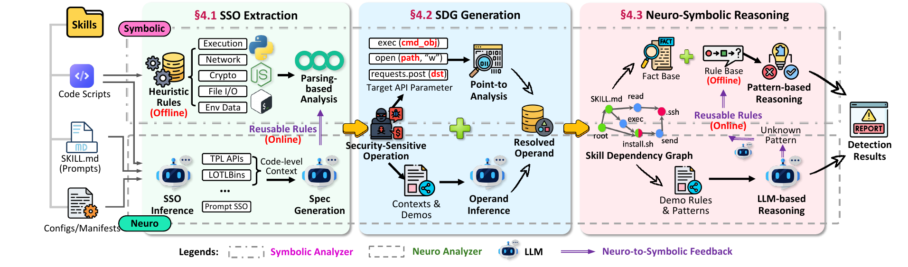

# MalSkills

MalSkills is a neuro-symbolic system for detecting malicious agent skills from heterogeneous skill artifacts.

It works in three stages:

1. **Security-Sensitive Operation extraction**: identify security-relevant operations from code, prompts, manifests, configuration files, and setup instructions.
2. **Skill Dependency Graph generation**: recover the operands of those operations and connect them through object identity and value-flow relations.
3. **Neuro-symbolic reasoning**: detect malicious behavior patterns or suspicious workflows from the graph.



## What the repository contains

- `malskills/`: main implementation
- `experiments/`: experiment drivers
- `data/`: benchmark and analysis inputs
- `output/`: generated results
- `baseline/`: baseline integrations
- `tests/`: regression tests
- `assets/`: figures used in this artifact

## Requirements

- Python `>= 3.9`
- optional `semgrep` for parsing-based extraction
- optional LLM API credentials in `.env` for full runs
- baseline-specific Python, Node.js, Go, Docker, and API dependencies as listed below

The project metadata is in `pyproject.toml`.

## Installation

```bash
git clone --recurse-submodules https://github.com/ShenaoW/MalSkills.git
cd MalSkills
python3 -m pip install -e .
```

For an existing checkout, synchronize and initialize every pinned baseline and
the YASA engine:

```bash
git submodule sync --recursive
git submodule update --init --recursive
git submodule status --recursive
```

## How to run MalSkills

Analyze a single skill:

```bash
malskills analyze-skill <skill-dir> --output <output-dir>
```

Run a single-skill static smoke test without LLM calls:

```bash
malskills analyze-skill <skill-dir> --output <output-dir> \
  --disable-llm-evidence \
  --disable-llm-object-analysis \
  --disable-yasa \
  --reasoning-mode formal
```

Run the full benchmark pipeline:

```bash
malskills run-eval \
  --benchmark output/ground_truth_final_benchmark.json \
  --output output/ground_truth_eval \
  --variant benchmark_full
```

Render a readable report:

```bash
malskills render-report --results output/ground_truth_eval
```

Inspect the resolved LLM runtime:

```bash
malskills show-llm-config
```

## Main outputs

Each analyzed skill produces:

- `verdict.json`: final label and score
- `all_evidence.json`: extracted security-sensitive operations
- `pattern_summary.json`: matched malicious or suspicious patterns
- `evidence_graph.json`: graph representation of recovered dependencies
- `proofs.json`: reasoning traces
- `human_report.md`: readable explanation

## Reproducing the benchmark experiments

### Main benchmark

The main labeled benchmark is:

- `output/ground_truth_final_benchmark.json`

Generate it from the checked-in ground-truth CSV if it is not present:

```bash
malskills build-benchmark-index \
  --root . \
  --output output/ground_truth_final_benchmark.json
```

Run the full system:

```bash
malskills run-eval \
  --benchmark output/ground_truth_final_benchmark.json \
  --output output/rq1_malskills \
  --variant benchmark_full
```

### Ablation variants

The evaluation variants are defined in `malskills/evaluation.py`.

Examples:

```bash
malskills run-eval \
  --benchmark output/ground_truth_final_benchmark.json \
  --output output/rq2_no_neuro_reasoning \
  --variant benchmark_formal_reasoning_only
```

```bash
malskills run-eval \
  --benchmark output/ground_truth_final_benchmark.json \
  --output output/rq2_no_symbolic_extractor \
  --variant benchmark_llm_evidence_only
```

```bash
malskills run-eval \
  --benchmark output/ground_truth_final_benchmark.json \
  --output output/rq2_no_neuro_extractor \
  --variant benchmark_semgrep_evidence_only
```

### LLM comparison

Use the dedicated RQ3 driver:

```bash
python3 experiments/run_rq3_llm_comparison.py \
  --benchmark output/ground_truth_final_benchmark.json \
  --output output/rq3_llm_comparison \
  --profile claude \
  --profile gemini \
  --profile qwen \
  --profile deepseek \
  --timeout-sec 180
```

The script reads model-specific settings from `.env`, runs each model separately, and writes per-model outputs plus summary CSV/JSON files.

## LLM environment variables

General runtime variables:

- `MALSKILLS_LLM_MODE`
- `MALSKILLS_LLM_MODEL`
- `MALSKILLS_LLM_API_KEY`
- `MALSKILLS_LLM_BASE_URL`
- `MALSKILLS_LLM_TIMEOUT_SEC`

RQ3 model-specific variables:

- `RQ3_CLAUDE_MODEL`, `RQ3_CLAUDE_API_KEY`, `CLAUDE_API_URL`
- `RQ3_GEMINI_MODEL`, `RQ3_GEMINI_API_KEY`, `GEMINI_API_URL`
- `RQ3_QWEN_MODEL`, `RQ3_QWEN_API_KEY`, `QWEN_API_URL`
- `RQ3_DEEPSEEK_MODEL`, `RQ3_DEEPSEEK_API_KEY`, `DEEPSEEK_API_URL`

## Baselines

Every adapter writes the upstream report, a normalized `output_manifest.json`,
and the common benchmark fields (`predicted`, `score`, and `patterns`). The
`benchmark_` prefix selects the same adapter while preserving the naming used
by benchmark experiments.

The default benchmark study includes the following deterministic static
baselines:

| Variant suffix | Tool | Runtime |
|---|---|---|
| `skill_security_audit_baseline` | skill-security-audit | Python |
| `skill_security_scan_baseline` | skill-security-scan | Python |
| `skills_security_audit_baseline` | skills_security_audit | Python |
| `caterpillar_baseline` | Caterpillar offline scanner | Node.js |
| `clawscan_baseline` | ClawScan by ClawGuard | Node.js |
| `skill_scanner_baseline` | Cisco AI Defense skill-scanner | Python |
| `nova_proximity_baseline` | Nova Proximity | Python |
| `agentguard_baseline` | GoPlus AgentGuard | Node.js |
| `skillspector_baseline` | NVIDIA SkillSpector (`--no-llm`) | Python |
| `agentverus_baseline` | AgentVerus Scanner | Node.js 22+ |
| `skilltotal_baseline` | SkillTotal | Python 3.10+ |
| `clawvet_baseline` | ClawVet offline scanner | Node.js 22+ |
| `razin_baseline` | Razin | Python 3.12+ |
| `openclaw_clawscan_baseline` | OpenClaw ClawScan static scanner | Go |
| `skillfortify_baseline` | SkillFortify | Python 3.11+ |

These integrations are available but remain opt-in because they require an
external service, an LLM, or sandboxed execution:

| Variant suffix | Tool | Additional requirement |
|---|---|---|
| `masb_baseline` | MaliciousAgentSkillsBench | Codex/OpenAI-compatible credentials for high-risk samples; `codex-skill-sandbox` for dynamic execution |
| `snyk_agent_scan_baseline` | Snyk Agent Scan | `SNYK_TOKEN` |
| `ai_infra_guard_baseline` | Tencent AI-Infra-Guard | `LLM_API_KEY` or `OPENAI_API_KEY` |
| `skillsieve_baseline` | SkillSieve | LiteLLM provider credentials |
| `skillward_baseline` | SkillWard | provider credentials, Docker, and its sandbox image |
| `runtime_skill_audit_baseline` | Runtime Skill Audit | LLM endpoint, OpenClaw, Docker, and `rsa_sandbox` |
| `skill_sentinel_baseline` | Enkrypt AI Skill Sentinel | `OPENAI_API_KEY`; `VIRUSTOTAL_API_KEY` is optional |

Submodules pin source revisions but do not install upstream dependencies. Use
an isolated environment for each Python tool and follow the corresponding
`baseline/<tool>/README*`; build Node.js tools in their own submodule. This
avoids dependency conflicts between research prototypes.

Run one baseline directly:

```bash
malskills run-eval \
  --benchmark output/ground_truth_final_benchmark.json \
  --output output/skillspector_baseline \
  --variant benchmark_skillspector_baseline
```

Run the study with MalSkills ablations and all offline static baselines:

```bash
python3 experiments/run_benchmark_study.py \
  --benchmark output/ground_truth_final_benchmark.json \
  --output output/benchmark_study
```

Include every optional baseline only after its external requirements are ready:

```bash
python3 experiments/run_benchmark_study.py \
  --benchmark output/ground_truth_final_benchmark.json \
  --output output/benchmark_study_all \
  --include-optional-baselines
```

Third-party code remains under each upstream project's license. In particular,
review the current AgentVerus licensing terms and SkillFortify's Elastic License
2.0 before redistribution or commercial use; a git submodule does not relicense
its contents under MalSkills.
